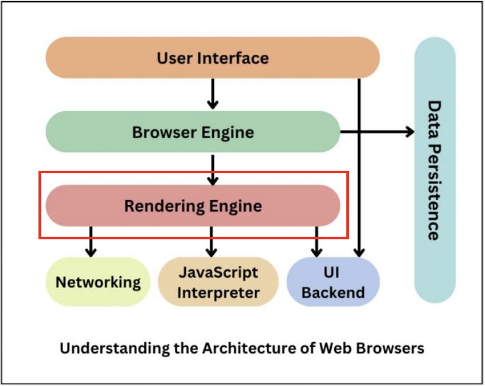

## Web-Study WIL2

### JavaScript가 Dom에 어떻게 접근하고 적용될까?
#### DOM이란?
- Document Object Model, 웹 페이지의 콘텐츠와 구조, 스타일 요소를 구조화시켜 표현하여 해당 문서에 접근하여 읽고 조작할 수 있도록 API를 제공하는 일종의 인터페이스
- DOM은 트리 구조를 가짐

#### JavaScript는 어떤 일을 하는가?
- DOM API: HTML과 CSS를 조작하여 HTML을 생성, 제거 및 변경하고 페이지에 스타일을 동적으로 적용하는등의 작업을 수행할 수 있음
-  JavaScript는 DOM API를 통해 HTML과 CSS를 동적으로 수정하여 사용자 인터페이스를 업데이트함

    
### 브라우저를 이루는 컴포넌트 중, JavaScript Engine은 무엇이고 어떤 일을 할까?
    

#### JavaScript Engine
- 자바스크립트 코드를 실행하는 프로그램 또는 인터프리터
    * 컴파일러 언어    
        코드를 바로 컴퓨터가 이해할 수 있는 머신 코드로 번역(컴파일)하고 이를 이용해 프로그램을 실행시킬 수 있음    
        ex. C, C++
    * 인터프리터 언어    
        컴퓨터가 바로 이해할 수 있는 실행 코드를 만드는 것이 아니라 중간 매개체인 인터프리터를 사용해 코드를 통역함   
        ex. JavaScript, Python

- 최초의 엔진은 단순한 인터프리터였지만 현대의 엔진은 JLT 또는 런타임 컴파일을 사용하여 성능을 향상시킴    
    * JIT(Just-in-time)    
        프로그램을 실행하는 시점에서 필요한 부분을 즉석으로 컴파일하는 방식

#### JavaScript Engine이 하는 일
- 자바스크립트 코드를 웹 브라우저나 다른 실행 환경에서 해석될 수 있는 최적화된 코드로 변환하는 일을 함
- 대부분의 현대 웹 브라우저는 자바스크립트 엔진을 내장하고 있음
    * Chrome - V8
    * Microsoft Edge - Chakra
    * Firefox/Mozilla - SpiderMonkey
    * Apple/Safari - Webkit

    
### Inline CSS가 항상 좋은 것일까?

#### HTML 파일에 CSS를 적용하는 방식
1. External CSS    
    HTML 파일 외부에 .css파일을 작성하고 `<head>`태그 안에 `<link>`태그를 이용하여 css파일을 적용하는 방식
2. Internal CSS    
    HTML 파일 내부의 `<head>`태그 안에 `<style>`태그를 이용하여 css를 적용하는 방식
3. Inline CSS    
    적용하고자 하는 태그 안에 HTML 요소의 style 속성을 이용하여 직접 css를 적용하는 방식

####  Inline CSS의 장점
- 별도의 css 파일이 필요없고, 간단하고 빠르게 스타일을 적용할 수 있음

#### Inline CSS의 단점
- 코드의 재사용성이 떨어짐    
    inline CSS는 요소마다 개별적으로 작성되기 때문에 재사용이 어렵다

- 유지보수가 어려움    
    HTML 코드가 복잡해지고 가독성이 떨어질 수 있다

- 우선순위 관련 문제가 발생할 수 있음    
    **CSS 우선 순위: Inline > External = Internal**
    inline CSS는 다른 스타일 규칙보다 우선시되므로 문제가 발생할 수 있음    

_Inline CSS는 지양하는 것이 좋다!_