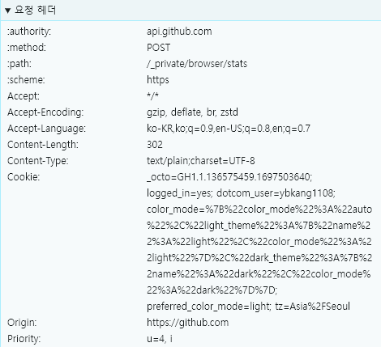

## Web-Study WIL3

### HTTP 통신 메소드: `GET`, `POST`, `PUT`, `PATCH`, `DELETE`

`GET`: 리소스를 조회하는 method, query를 통해서 서버에 데이터 전달

_imhere사이트에 접속할 때 GET method 사용됨_
 
 

`POST`: 요청 데이터를 처리하는 method, msg body를 통해 서버로 요청 데이터 전달    
**주로 신규 리소스를 등록하고 프로세스를 처리하는 데 사용**

_toslide 사이트에서 토큰을 전달할 때 POST method 사용됨_
 
 

`PUT`: 리소스가 있다면 요청을 보낸 데이터로 **덮어씌우고** 없다면 새로 생성

_REST API를 사용한 개발 서버에서 데이터를 추가할 때 사용됨_
 
 

`PATCH`: 리소스의 **부분 변경**

_ChatGPT에서 채팅의 이름을 변경하거나 삭제할 때 PATCH method 사용됨_
 
 

`DELETE`: 요청받은 리소스 제거

_REST API를 사용한 개발 서버에서 데이터를 추가할 때 사용됨_
 
 

### HTTP의 역사

#### HTTP/1.0: Separate Connections
- 하나의 연결당 하나의 요청 처리 -> object마다 TCP를 열고 닫아야 함
- 필요한 만큼 연결과 해제 과정을 반복해야 하므로 HTTP response time이 긺    
    : 2RTT(Round Trip Time) + file transmission time
 

#### HTTP/1.1: Persistent Connections
- HTTP/1.0을 보완하여 일정 시간동안 연결 상태를 유지
- Pipelining 추가
    + 앞서 보낸 request에 대한 response를 받은 후 다음 request를 보내는 게 아니라 연속적으로 request를 보냄
    + HOL Blocking(Head Of Line Blocking) 문제 존재
    + 앞의 request에 대한 response가 늦어지면 뒤에 금방 처리할 수 있는 request의 response도 지연됨

        

#### HTTP/2.0
- object를 frame 단위로 나누어 전송해 HOL Blocking 문제 해결

    

- request의 우선순위를 지정하고 우선순위가 높은 request를 먼저 처리할 수 있게 됨
 

#### HTTP/3.0 
- TCP가 아닌 **UDP 기반**
- QUIC(Quick UDP Internet Connections) 사용
    
    

    + TLS handshake와 달리 QUIC handshake는 negotiation이 없음    
     -> 상대방이 지원할만한 방법을 제시한 후 합의 과정 없이 사용, 상대방이 받아들이지 못하면 연결이 종료됨

     + parallelism streams 사용    
      -> 여러 개의 stream이 존재해 하나가 에러가 발생하더라도 다음 거를 전송할 수 있음
 
 

### GET / POST header

`GET`

- authority : 요청을 보낼 서버의 호스트 이름과 포트 지정
- Accept : 클라이언트가 처리할 수 있는 미디어 타입 (text/html)
- Accept-Encoding : 클라이언트가 지원하는 인코딩 방식
- Accept-Language : 클라이언트가 선호하는 언어
- User-Agent : 클라이언트 application의 정보

 

`POST`

- authority, Accept, Accept-Encoding, Accept-Language, User-Agent
- Content-Length : 요청 본문 데이터의 길이
- Content-Type : 요청 본문에 포함된 미디어의 타입

 

GET은 URL에 데이터를 포함시키고 POST는 request body에 데이터를 포함시킨다 -> POST가 보안 측면에서 더 나음