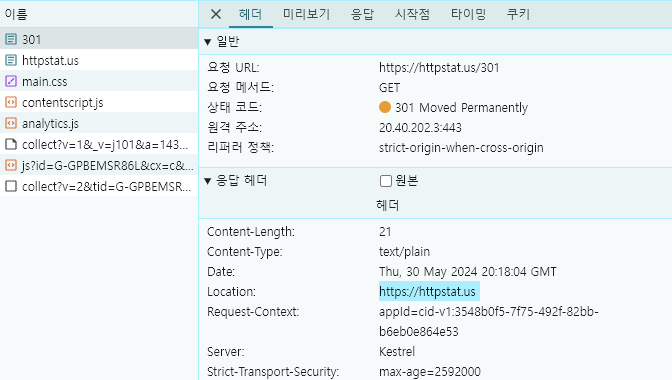

## Web-Study WIL4

### Q1. 301, 303 요청을 하였을때, 왜 httpstat.us 페이지의 메인으로 redirect될까?

- 301 Moved Permanently
    + 요청된 리소스가 영구적으로 다른 위치로 이동했음을 나타냄
    + response에서 Location 헤더는 새 URL을 가리키고 클라이언트는 해당 URL로 자동으로 리디렉션 됨
- 303 See Other
    + 요청에 대한 응답을 다른 URI에서 가져와야 함을 나타냄
        * 주로 POST 요청의 결과를 GET 요청을 통해 조회함으로써 요청이 중복으로 전송되는 것을 막는 데 쓰임
    + response에서 Location 헤더는 그 페이지의 URL을 가리킴

따라서 301 요청과 303 요청을 했을 때 메인 페이지로 리디렉션 되는 이유는 응답 헤더의 Location에 메인 페이지의 주소인 `https://httpstat.us` 가 들어있기 때문이다.

    
    

 

### Q2. 401 요청을 하였을 때, 네트워크 탭의 상태를 보고 어떻게 인증해야 하는지 www-Authenticate 헤더를 기반으로 설명해보자.

401 Unauthorized: 요청된 리소스에 대해 인증이 필요하지만 클라이언트가 인증을 제공하지 않음

HTTP 기본 인증을 위한 Www-Authenticate 헤더 양식 : `Www-Authenticate: Basic realm="{REALM}"`

- REALM는 HTTP 인증에서 해당 인증 요청이 적용되는 특정 영역 또는 리소스 그룹을 나타내는 식별자
- 사용자에게 보안 영역이나 데이터가 속한 컨텍스트를 제공해 사용자가 어떤 자원에 접속하려고 하는지를 이해할 수 있게 함

클라이언트가 서버로부터 위의 요청을 받으면 `Authroization: Basic userid:password` 형식의 인증 헤더를 첨부하여 서버에 다시 요청한다

 

### Q3. Google에 “Hello”를 입력하여 결과물을 보고, 네트워크 요청 탭에서 캐시 관련 정보가 어디에 저장되어 있는지 분석하여 보자.

    
    

 

- Cache-Control: 해당 리소스의 캐싱 정책 정의
    + `private` : 리소스가 오직 개별 사용자에게만 캐시될 수 있음을 의미
    + max-age: 리소스가 캐시에 유효하게 저장될 수 있는 최대 시간을 초 단위로 지정  
    `max-age=0`는 유효시간이 0이라는 것을 의미하므로 해당 리소스를 사용하기 전에 항상 서버로부터 최신 버전의 리소스를 확인하도록 요구함
- Expires: 리소스가 만료되는 날짜와 시간
`Expires: -1`은 브라우저에게 이 리소스를 캐시하지 말고 매번 서버에 요청하여 최신 버전을 받아오라는 것을 의미

 

### Q4. 더 알고 싶은 상태코드를 직접 체험해보고, 해당 상태코드에서 진행한 요청 헤더, 응답 헤더를 직접 정리하여 분석해보자.

429 Too Many Requests: 클라이언트가 일정 기간 동안 서버에 너무 많은 요청을 보냈을 때 서버가 응답하는 코드

    
    

 

`Retry-After` : 클라이언트가 언제 다시 요청을 시도할 수 있는지 알려주는 헤더로 날짜와 시간 형식 또는 초 단위의 시간으로 지정됨
- `Retry-After: 5` : 5초 뒤에 다시 시도할 수 있음을 의미한다!

 

---
### + Q. . 캐시 유효 시간이 60초라고 가정해보자. 그럼 60초가 지날 때마다 캐시 데이터를 처음부터 네트워크를 통해 다시 받아하는 거 아닌가? 과연 이러한 방식이 올바를까?

-> 캐시의 유효 시간이 지났을 때 항상 리소스의 최신 버전을 요청하는 게 아니라 리소스가 마지막으로 가져온 이후에 수정되었는지 여부만 확인하면 된다!
: **조건부 요청(Conditional Requests)**

-> 수정되었는지 어떻게 확인할까?

- 검증 헤더(Validation Headers)
    + Last-Modified: 리소스가 마지막으로 변경된 날짜와 시간을 나타냄
    + ETag(Entity Tag): 리소스의 특정 버전을 고유하게 식별하는 식별자

- 조건부 요청 헤더
    + If-Modified-Since: 클라이언트가 가진 리소스의 Last-Modified값보다 서버의 리소스가 더 최근에 수정되었는지를 확인
    + If-None-Match: 클라이언트가 가진 리소스의 ETag값과 서버 리소스의 ETag 값이 일치하는지 확인

- 304 Not Modified: 클라이언트가 조건부 요청을 보냈을 때 서버의 리소스가 클라이언트가 가진 버전과 같다면 서버는 304 응답을 보냄
    + 304 Not Modified는 body없이 헤더만 전송하기 때문에 네트워크 대역폭을 절약하고 응답 시간을 단축할 수 있다!